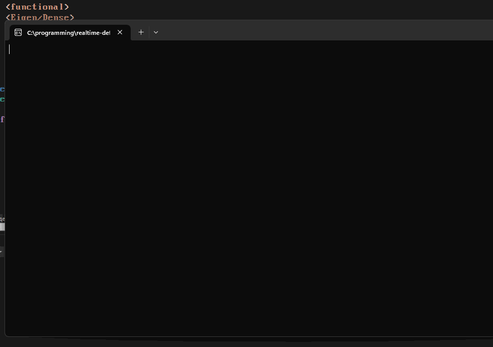
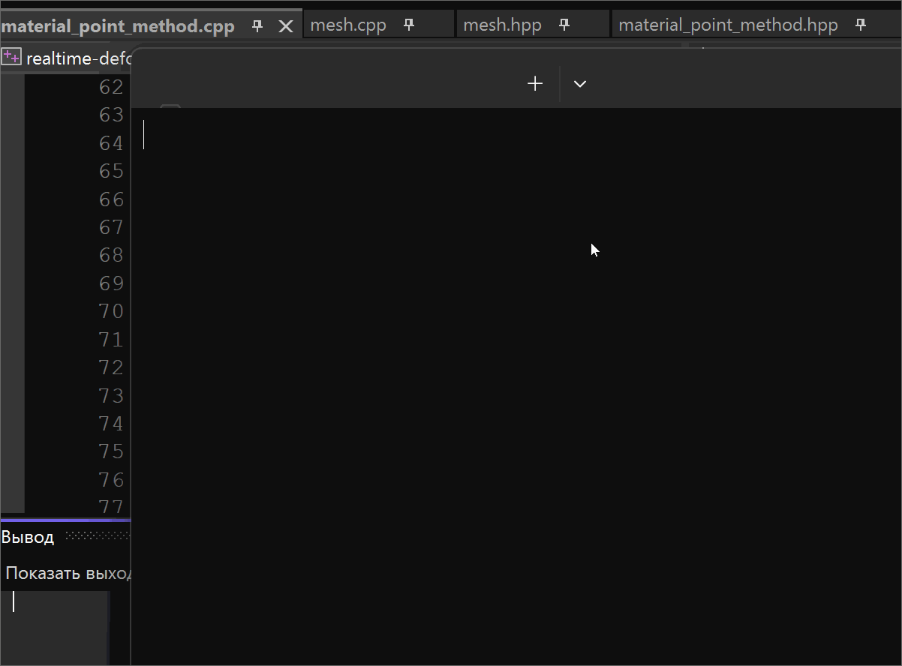

A toy implementation of so-called "Material Point Method" to understand if i'm able to implement a physics-related paper.
Turns out, i am :).

Uses OpenGL for particle visualization, CUDA for (some) parallel processing, GLM for linear algebra operations, Eigen for matrix operations not included in GLM (e.g. SVD matrix decomposition).

Realtime demos (the first is the freshest :))

TODO

[x] APIC
[ ] Implicit time integration
[ ] Multithreading for all MPM stages
[ ] Volume rendering or sth idk separate particles are (not) fine

Papers used:
* "A material point method for snow simulation" [https://www.math.ucla.edu/~jteran/papers/SSCTS13.pdf]
* "GPU Optimization of Material Point Methods" [https://dl.acm.org/doi/pdf/10.1145/3272127.3275044]
* "Material point method after 25 years: theory, implementation and applications" [https://www.researchgate.net/publication/336796234_Material_point_method_after_25_years_theory_implementation_and_applications]
* "The Material Point Method for Simulating
Continuum Materials" [https://cg.informatik.uni-freiburg.de/intern/seminar/animation%20-%20MPM%20survey%20-%202016.pdf]
* "Optimization Integrator for Large Time Steps" [https://www.math.ucla.edu/~jteran/papers/GSSJT15.pdf]
* "Modelling cracks in solid materials using the Material Point Method" [http://www.diva-portal.org/smash/get/diva2:1091115/FULLTEXT01.pdf]
* "Drucker-Prager Elastoplasticity for Sand Animation" [https://dl.acm.org/doi/pdf/10.1145/2897824.2925906]
* "A Moving Least Squares Material Point Method with Displacement Discontinuity and Two-Way Rigid Body Coupling" [https://yzhu.io/publication/mpmmls2018siggraph/paper.pdf]